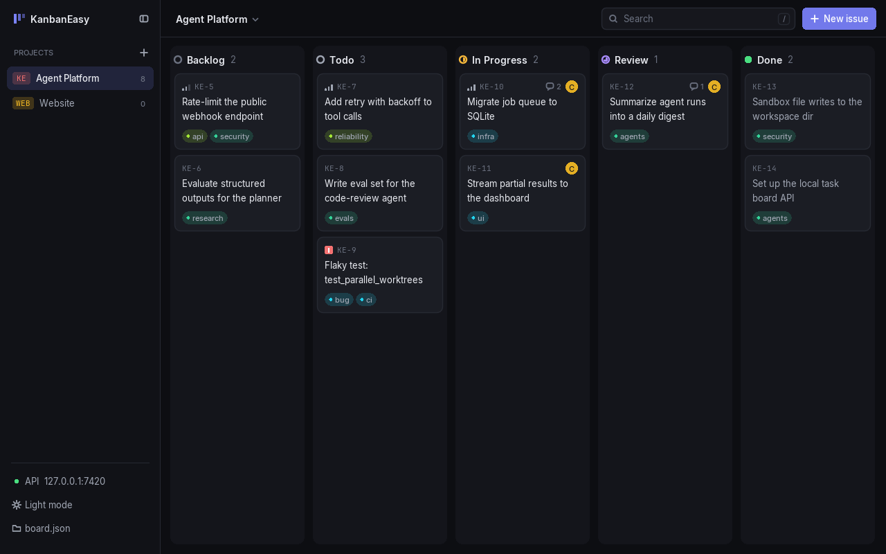
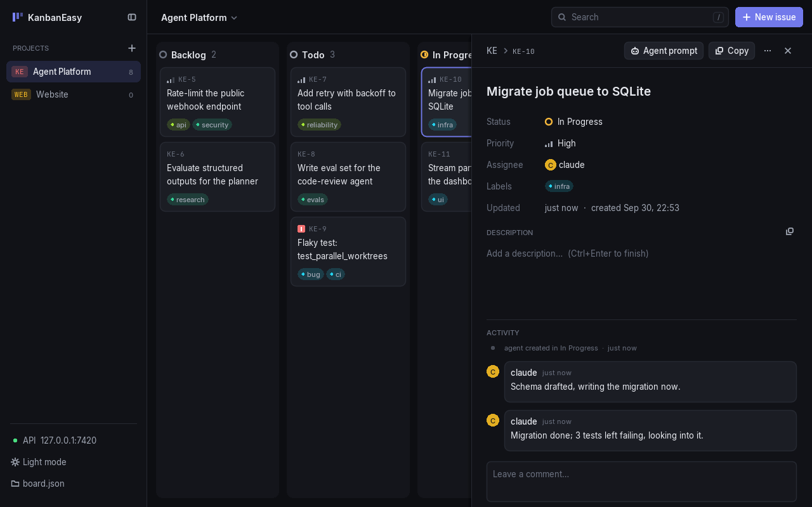
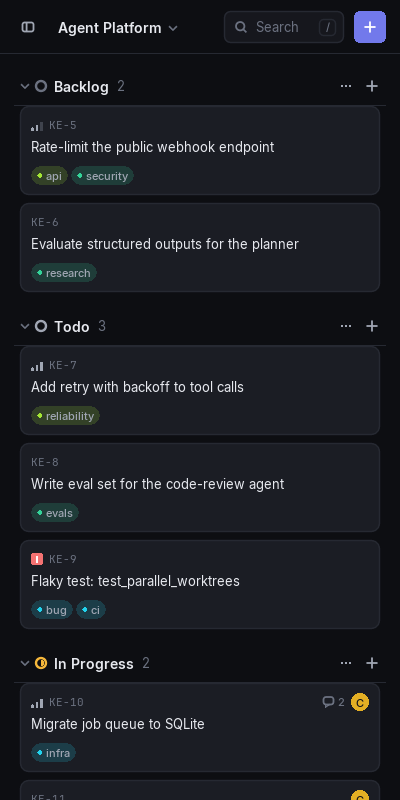

# KanbanEasy

A small, fast, native kanban board for keeping track of agentic AI work. No accounts, no cloud, no config screens.
Keep it docked next to your editor and let your coding agents update it over a local HTTP API.
Built with [LÖVE](https://love2d.org) (Lua). Free and open source under the MIT license.

| Issue detail | Docked to the side |
| --- | --- |
|  |  |

## Download

Grab the latest build from the **[Releases page](https://github.com/Siekwie/KanbanEasy/releases/latest)**:

- **Windows**: unzip `KanbanEasy-windows.zip` and run `KanbanEasy.exe`.
- **macOS**: unzip `KanbanEasy-macos.zip` and move `KanbanEasy.app` to Applications. It isn't signed, so the first
  time, right-click → Open (or run `xattr -dr com.apple.quarantine KanbanEasy.app`).
- **Linux**: `chmod +x KanbanEasy-x86_64.AppImage && ./KanbanEasy-x86_64.AppImage`

Prefer to build it yourself or run from source? See [docs/BUILDING.md](docs/BUILDING.md).

## Quick start

1. Launch KanbanEasy. Press `N`, type `Fix flaky test #ci @agent !high` and hit Enter.
2. Drag cards between columns, or press `?` to see every keyboard shortcut.
3. Hand work to an agent: right-click the API line at the bottom of the sidebar and choose **Copy agent
   instructions**, then paste that into your `CLAUDE.md` / `AGENTS.md` or system prompt.

## Features

- **Board**: columns you can drag cards between, smooth reordering, and undo/redo for everything.
- **Fast capture**: labels, assignee and priority are parsed out of the title, and the input stays open for the next card.
- **Everything editable in place**: title, description, status, priority, assignee, labels, comments.
- **Copy anything**: ID, title, Markdown, or a ready-to-paste **agent prompt** with the task and the commands to report progress.
- **People & rules**: tell the board who "me" and "agent" are, and give columns rules like "cards landing in Review go to the agent".
- **Activity tracking**: every move and assignment is logged with who did it. Cards glow when an agent changes them.
- **Local API**: plain JSON over HTTP on `127.0.0.1:7420`. No MCP needed. A `kb` CLI wrapper is included.
- **Docks nicely**: below ~540px wide the board becomes a stacked list. Light and dark themes, low idle CPU.
- **Your data stays yours**: one human-readable JSON file in `~/KanbanEasy`, with daily backups.

## Documentation

- [Using KanbanEasy](docs/USAGE.md): keyboard shortcuts, people & rules, where your data lives
- [Local API and `kb` CLI](docs/API.md): everything an agent needs
- [Building and developing](docs/BUILDING.md): build from source, tests, code layout
- [Contributing](CONTRIBUTING.md)

## License

[MIT](LICENSE) © 2026 Jannik Wiest. Bundled fonts: [Inter](https://rsms.me/inter/) and
[JetBrains Mono](https://www.jetbrains.com/lp/mono/), both under the SIL Open Font License (see `assets/fonts/`).
